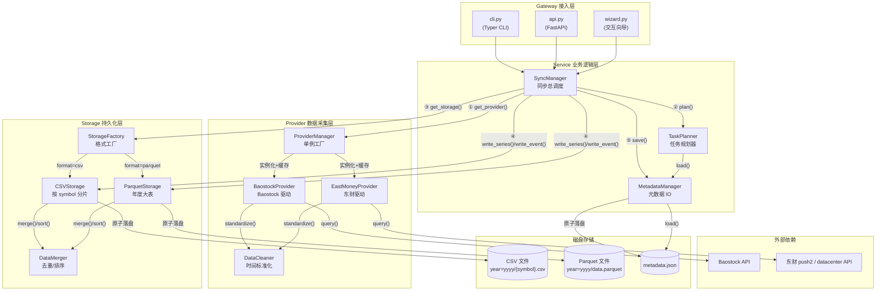

# AGENTS.md - CarrotQuant.Data 代码指南

本文档为 AI Agent 提供对 CarrotQuant.Data 项目的完整理解，包含架构、模块、类关系、数据流和开发约束。

---

## 1. 项目概述

CarrotQuant.Data 是一个轻量级、模块化的本地金融数据同步与管理工具。它从免费数据源（Baostock、东方财富）获取 A 股/指数数据，清洗后持久化到本地 CSV/Parquet 文件，供量化研究和回测使用。

**核心能力**：
- 从 Baostock 下载 K 线（日线/5 分钟线）、复权因子等数据
- 从东方财富下载概念/行业板块、龙虎榜、机构交易等数据
- 支持 CSV 和 Parquet 两种存储格式
- 基于时间戳水位线的增量同步，支持断点续接
- 三种入口：交互向导 (Wizard)、CLI 命令行、FastAPI REST API

**技术栈**：Python >= 3.12, Polars (数据处理), Baostock (数据源), curl_cffi (东财防封), FastAPI (API), Typer (CLI), Loguru (日志), Pydantic-Settings (配置)

---

## 2. 目录结构与模块职责

```
CarrotQuant.Data/
├── app/
│   ├── config/           # 配置管理
│   │   ├── __init__.py   # 导出 settings 单例
│   │   └── settings.py   # Settings 类，从 config/config.yaml 加载
│   ├── gateway/          # 接入层
│   │   ├── cli.py        # Typer CLI 入口 (sync, server 命令)
│   │   └── api.py        # FastAPI REST API (同步/查询/任务状态)
│   ├── provider/         # 数据源驱动层
│   │   ├── base.py       # BaseProvider 抽象基类
│   │   ├── baostock_provider.py  # BaostockProvider 实现
│   │   ├── eastmoney_provider.py # EastMoneyProvider 实现
│   │   ├── em_utils.py          # 东财 HTTP 工具 (防封/节流/重试)
│   │   ├── provider_manager.py   # ProviderManager 单例工厂
│   │   └── data_cleaner.py       # DataCleaner 时间标准化工具
│   ├── service/          # 业务逻辑层
│   │   ├── sync_manager.py       # SyncManager 同步总调度
│   │   ├── task_planner.py       # TaskPlanner 任务规划器
│   │   └── metadata_manager.py   # MetadataManager 元数据IO
│   ├── storage/          # 持久化存储层
│   │   ├── base.py               # StorageManager 抽象基类
│   │   ├── csv_storage.py        # CSVStorage 实现
│   │   ├── parquet_storage.py    # ParquetStorage 实现
│   │   ├── storage_factory.py    # StorageFactory 工厂
│   │   └── data_merger.py        # DataMerger 合并/去重/排序
│   └── utils/            # 工具箱
│       ├── logger_utils.py       # setup_logger + SuppressOutput
│       └── time_utils.py         # 时间戳/ISO/日期转换工具
├── scripts/
│   └── wizard.py         # 交互式同步向导
├── tests/
│   ├── conftest.py       # pytest fixtures (temp_storage_root, mock_baostock)
│   ├── unit/             # 单元测试
│   ├── integration/      # 集成测试
│   └── gateway/          # API 网关测试
└── pyproject.toml        # 项目依赖与构建配置
```

---

## 3. 系统架构

### 3.1 分层架构图



### 3.2 数据流：一次同步的完整链路

```
用户请求 (CLI/API/Wizard)
    │
    ▼
Gateway (cli.py / api.py)
    │  解析参数，封装为 SyncManager.sync() 调用
    ▼
SyncManager.sync()
    │
    ├── 1. ProviderManager.get_provider(table_id)
    │      解析 table_id 末段 "baostock" → 实例化 BaostockProvider (单例缓存)
    │
    ├── 2. Provider.get_table_category(table_id)
    │      返回 "timeseries" 或 "event"，决定存储策略
    │
    ├── 3. Provider.get_all_symbols(table_id)
    │      调用 Baostock API 获取全市场有效证券代码列表
    │
    ├── 4. TaskPlanner.plan(table_id, formats, symbols, dates)
    │      加载各格式的 metadata.json，对比用户请求与本地水位线
    │      计算每个 symbol 需要补齐的时间区间 → List[Dict]
    │
    ├── 5. 批处理循环 (batch_size 控制)
    │   │
    │   ├── 5a. 逐 symbol 调用 Provider.fetch(table_id, symbol, start_ts, end_ts)
    │   │       Baostock API 调用 → 原始数据 → DataCleaner.standardize()
    │   │       生成标准化 DataFrame (含 timestamp, datetime, symbol 列)
    │   │
    │   └── 5b. 批次聚合: pl.concat(batch_dfs) → big_df
    │          分发到各格式的 Storage.write_series() 或 write_event()
    │
    └── 6. 物理巡检 + 元数据盖章
           对每个格式:
           - Storage.get_total_bars() / get_global_time_range() / get_all_symbols()
           - 构建 metadata.json (table_id, category, format, schema, statistics)
           - MetadataManager.save() 原子化写入
```

---

## 4. 核心类详解

### 4.1 配置层

**`app/config/settings.py` — `Settings`**
- 继承: `pydantic_settings.BaseSettings`
- 属性 `PROJECT_ROOT`: Path，项目根目录
- 属性 `STORAGE_ROOT`: str，默认 `"storage_root"`
- 初始化: 从 `config/config.yaml` 加载覆盖
- 全局单例: `settings = Settings()`

### 4.2 工具层

**`app/utils/time_utils.py`**
- `parse_date_to_ts(date_val, source_tz)` → int
  - 将 "YYYY-MM-DD" 字符串按指定时区解析为 UTC 毫秒戳
  - 整数直接透传
- `ts_to_iso(ts_ms, display_tz)` → str
  - UTC 毫秒戳 → ISO8601 带偏移字符串
  - 示例: `"2024-01-01T08:00:00.000+08:00"`
- `ts_to_str(ts_ms, fmt, display_tz)` → str
  - UTC 毫秒戳 → 自定义格式字符串

**`app/utils/logger_utils.py`**
- `setup_logger(log_level, log_file_prefix)`: 初始化 loguru
  - 控台输出: stderr，带颜色格式化
  - 文件输出: `logs/{prefix}_{timestamp}.log`
- `SuppressOutput`: 上下文管理器
  - 将 stdout/stderr 重定向到 `/dev/null`
  - 用于屏蔽 Baostock 等第三方库的 print 输出

### 4.3 Provider 层（数据采集）

**`app/provider/base.py` — `BaseProvider` (ABC)**
- `fetch(table_id, symbol, start_date, end_date)` → pl.DataFrame
  - 原子化下载，单次仅处理单支证券
- `get_all_symbols(table_id)` → list[str]
  - 返回市场下所有有效证券代码
- `get_supported_tables()` → list[str]
  - 返回驱动支持的所有 table_id
- `get_table_category(table_id)` → str
  - 返回 `"timeseries"` 或 `"event"`

**`app/provider/baostock_provider.py` — `BaostockProvider(BaseProvider)`**
- `_SUPPORTED_TABLE_MAP`: 类级字典，映射 table_id → category
  - `ashare.kline.1d.adj.baostock` → `"timeseries"`
  - `ashare.kline.1d.raw.baostock` → `"timeseries"`
  - `ashare.kline.5m.adj.baostock` → `"timeseries"`
  - `ashare.kline.5m.raw.baostock` → `"timeseries"`
  - `aindex.kline.1d.raw.baostock` → `"timeseries"`
  - `ashare.adj_factor.baostock` → `"event"`
- `__init__()`: 登录 Baostock (SuppressOutput 包裹)
- `__del__()`: 登出 Baostock
- `get_all_symbols()`:
  - 调用 `bs.query_stock_basic()`
  - 根据 table_id 前缀过滤: `ashare` → type=1 (个股), `aindex` → type=2 (指数)
- `fetch()`: 根据 table_id 中间段路由到:
  - `_fetch_kline()`:
    - 调用 `bs.query_history_k_data_plus()`
    - 解析频率: `1d` → `d`, `5m` → `5`
    - 解析复权: `raw` → `3`, `adj` → `1`
    - 字段重命名: `code` → `symbol`, `pctChg` → `change_pct` 等
    - 数值类型: `cast(pl.Float64)`
    - 调用 `DataCleaner.standardize()`
  - `_fetch_adj_factor()`:
    - 调用 `bs.query_adjust_factor()`
    - 保留: `backAdjustFactor` → `back_adj_factor`
    - 剔除: `foreAdjustFactor`, `adjustFactor`
- 日期默认值: `start_date=None` → `"2020-01-01"`, `end_date=None` → `datetime.now()`（与 EastMoneyProvider 统一）
- 空数据防御: 空数据时仍执行 cast 和时间标准化，与有数据时保持单一代码路径
- 异常分发: API 报错 (error_code != '0') 抛 RuntimeError；无数据返回标准化空表

**`app/provider/eastmoney_provider.py` — `EastMoneyProvider(BaseProvider)`**
- `_SUPPORTED_TABLE_MAP`: 类级字典，映射 table_id → category
  - `ashare.concept.eastmoney` → `"event"` — 概念板块成分股
  - `ashare.industry.eastmoney` → `"event"` — 行业板块成分股
  - `ashare.dragon_tiger.eastmoney` → `"event"` — 龙虎榜
  - `ashare.inst_trade.eastmoney` → `"event"` — 机构买卖每日统计
- `_board_name_cache`: 类级字典，缓存 `{board_type: {"board_code": "board_name"}}`，避免重复拉取板块列表
- `get_all_symbols()`:
  - 龙虎榜/机构交易表 → 返回 `["_ALL_"]`
  - 板块成分股表 → 调用 push2 API 获取板块代码列表
- `fetch()`: 根据 table_id 路由到:
  - `_fetch_board_cons_df()`: push2 板块成分股，返回 symbol + stock_name + board_code + board_name
  - `_fetch_dragon_tiger()`: datacenter 龙虎榜，按月分批 + 自动分页
  - `_fetch_inst_trade()`: datacenter 机构交易，按月分批 + 自动分页
- 日期默认值: `start_date=None` → `"2020-01-01"`, `end_date=None` → `datetime.now()`
- 空数据防御: 创建 DataFrame 时指定 schema（所有列 String），空数据时也执行 cast 和时间标准化，与有数据时保持单一代码路径
- symbol 标准化: `_to_standard_symbol()` 将纯数字代码转为 `sh./sz./bj.` 前缀格式（6→sh, 8/4→bj, 其余→sz），三处调用：板块成分股、龙虎榜、机构交易
- 防封策略: curl_cffi TLS 指纹模拟 + 全局节流 + tenacity 自动重试

**`app/provider/em_utils.py` — 东财 HTTP 工具**
- `em_get()`: 统一请求入口，自动节流 + 重试 + TLS 指纹模拟
- `em_push2()`: push2 行情接口，自动回退多个 URL 应对封禁
- `em_datacenter()`: 东财数据中心单次查询（龙虎榜/解禁/融资融券等共用），返回 `{"data": [...], "count": N}`
- 防封策略: curl_cffi impersonate="chrome" + EM_MIN_INTERVAL 节流 + EM_MAX_RETRIES 重试

**`app/provider/data_cleaner.py` — `DataCleaner`**
- `standardize(df, time_col, time_fmt, source_tz, display_tz, time_shift_hours)` → pl.DataFrame
  - 将 time_col 解析为 Datetime
  - 标记为 source_tz → 转 UTC 得 timestamp (Int64 ms)
  - 转 display_tz 得 datetime (ISO8601 String)
  - 核心列 [symbol, datetime, timestamp] 强制移到最前
  - 剔除原始 time_col
  - time_shift_hours: 偏移至收盘时间 15:00 (A 股分区边界安全)

**`app/provider/provider_manager.py` — `ProviderManager`**
- 单例模式 (`__new__`)
- `get_provider(table_id)` → BaseProvider
  - 解析 table_id 末段 → 实例化对应 Provider (baostock / eastmoney)

### 4.4 Service 层（业务逻辑）

**`app/service/task_planner.py` — `TaskPlanner`**
- `__init__(metadata_mgr)`: 注入 MetadataManager
- `plan(table_id, formats, symbols, start_date, end_date, force_refresh)` → List[Dict]
  - 加载各格式的 metadata.json 统计信息
  - 多格式水位聚合: start 取 max, end 取 min (木桶原理)
  - 日期推导:
    - 无 start_date 且有本地数据 → 从 loc_end 开始 (增量)
    - 无本地数据 → 必须提供 start_date
  - 为每个 symbol 计算一个补丁任务:
    - force_refresh / 无本地数据: 全量覆盖
    - 前向补全 (req_start < loc_start): task_start=req_start, task_end=max(req_end, loc_start)
    - 后向拓展 (req_end > loc_end): task_start=loc_end, task_end=req_end
    - 已覆盖: 跳过
  - 过滤无效区间 (start >= end)

**`app/service/metadata_manager.py` — `MetadataManager`**
- `__init__(storage_root)`: 根路径
- `_get_metadata_path(table_id, format)` → Path
  - 路径: `storage_root/{format}/{table_id}/metadata.json`
- `load(table_id, format)` → dict
  - 存在则读 JSON，不存在返回 `{}`
- `save(table_id, format, metadata)`
  - 原子化写入: .tmp → os.replace → fsync

**`app/service/sync_manager.py` — `SyncManager`**
- `__init__(storage_root)`: 实例化 MetadataManager, TaskPlanner, ProviderManager
- `sync(table_ids, formats, start_date, end_date, force_refresh, batch_size, symbol_limit)`
  - 遍历每个 table_id 调用 `_sync_single_table()`
- `_sync_single_table()`:
  1. 获取 Provider + Category
  2. 创建各格式 Storage 实例 (via StorageFactory)
  3. 发现全量 Symbol (可选 limit 截断)
  4. TaskPlanner 规划补丁任务
  5. 批处理循环: 逐 symbol fetch → 聚合 → 多路下沉到各格式 Storage
  6. 物理巡检 + 元数据更新 (_update_metadata)
- `_update_metadata()`:
  - 获取 total_bars, time_range, schema
  - TS 补充 symbol_count, time_steps (高 IO)
  - EV 仅保留基础统计 (0 IO)
  - 静默拦截:
    - total_bars=0 且无元数据 → 不创建文件
    - 无新数据且已有元数据 → 不更新

### 4.5 Storage 层（持久化）

**`app/storage/base.py` — `StorageManager` (ABC)**
- 属性 `category`: timeseries / event
- 属性 `partition`: abstract
- 属性 `layout`: abstract
- 抽象方法:
  - `read_series(table_id, symbol, year)` → pl.DataFrame
  - `read_event(table_id, year)` → pl.DataFrame
  - `write_series(table_id, df, mode)` → None
  - `write_event(table_id, df, mode)` → None
  - `get_all_symbols(table_id)` → list[str]
  - `get_total_bars(table_id)` → int
  - `get_global_time_range(table_id)` → tuple[int, int]
  - `get_unique_timestamps(table_id)` → list[int]

**`app/storage/csv_storage.py` — `CSVStorage(StorageManager)`**
- `__init__(storage_root, category, partition, layout)`
  - storage_root 传入时已是 `storage_root/csv`
- `partition` 属性:
  - TS → `"symbol"`
  - EV → `"none"`
- TS 路径: `{root}/{table_id}/year={yyyy}/{symbol}.csv`
- EV 路径: `{root}/{table_id}/year={yyyy}/data.csv`
- `_read_with_schema(table_id, path, schema_override)`:
  - 从 metadata.json 加载 schema → 映射 Polars DataType → pl.read_csv(schema=...)
- `write_series()`:
  - 按 [symbol, year] 分组
  - 增量模式读旧数据
  - DataMerger.merge (TS: subset=[symbol,timestamp])
  - 排序 (TS: [timestamp])
  - 原子落盘
- `write_event()`:
  - 按 [year] 分组
  - 增量模式
  - DataMerger.merge (EV: subset=None 全行去重)
  - 排序 (EV: [timestamp, symbol])
  - 原子落盘
- `get_all_symbols()`:
  - EV 返回 []
  - TS glob year=*/*.csv 取文件名
- `get_total_bars()`: pl.scan_csv 通配符统计
- `get_global_time_range()`: pl.scan_csv min/max timestamp

**`app/storage/parquet_storage.py` — `ParquetStorage(StorageManager)`**
- `partition` 属性: 始终 `"none"` (Parquet 按年聚合大表)
- TS 路径: `{root}/{table_id}/year={yyyy}/data.parquet`
- EV 路径: `{root}/{table_id}/year={yyyy}/data.parquet` (同 TS)
- `_read_with_schema()`: pl.read_parquet → cast(schema)
- `write_series()`:
  - 按 [year] 分组
  - 增量合并
  - 排序 (TS: [symbol, timestamp], Symbol-First)
  - zstd 压缩写入
- `write_event()`:
  - 按 [year] 分组
  - 全行去重
  - 排序 (EV: [timestamp, symbol])
  - 原子落盘
- 统计接口基于 pl.scan_parquet 元数据提取

**`app/storage/storage_factory.py` — `StorageFactory`**
- `get_storage(format, storage_root, category)` → StorageManager
  - `"csv"` → `CSVStorage(storage_root=f"{storage_root}/csv", category=category)`
  - `"parquet"` → `ParquetStorage(storage_root=f"{storage_root}/parquet", category=category)`

**`app/storage/data_merger.py` — `DataMerger`**
- `merge(old_df, new_df, subset)` → pl.DataFrame
  - pl.concat → unique(subset, keep="last")
  - subset=None 全行去重
- `sort(df, keys)` → pl.DataFrame
  - 动态过滤不存在的列后排序
  - 默认 keys=["timestamp", "symbol"]

### 4.6 Gateway 层（接入层）

**`app/gateway/cli.py` — Typer CLI**

命令 `sync`:
- `--tables` / `-t` (必填): 同步的 table_id，逗号分隔
- `--formats` / `-f` (默认 `"csv,parquet"`): 同步格式，逗号分隔
- `--start` / `-s` (可选): 起始日期 YYYY-MM-DD
- `--end` / `-e` (可选): 结束日期 YYYY-MM-DD
- `--force` (默认 False): 是否强制全量刷新水位线
- `--batch` (默认 100): 批量聚合长度
- `--limit` (可选): 限制同步的证券数量
- `--output` / `-o` (可选): 自定义存储根目录

命令 `server`:
- `--host` / `-h` (默认 `"0.0.0.0"`): 监听地址
- `--port` / `-p` (默认 8000): 监听端口
- `--reload` (默认 True): 是否开启热重载

**`app/gateway/api.py` — FastAPI REST API**

应用元信息:
- title: `"CarrotQuant.Data API"`
- version: `"1.0.0"`

`POST /api/v1/sync` — 异步触发数据同步
- 请求体 (SyncRequest):
  - `table_ids`: List[str] (必填)
  - `formats`: List[str]，默认 `["csv"]`
  - `start_date`: Optional[str]
  - `end_date`: Optional[str]
  - `force_refresh`: bool，默认 False
  - `batch_size`: int，默认 100
- 并发防御: ACTIVE_SYNC_TASKS set 防止同一 table_id 并发写入
- 冲突拦截: table_id 已在集合中 → 409 Conflict
- 异步执行: BackgroundTasks + finally 块释放锁
- 响应 200:
  - `status`: `"accepted"`
  - `started_tasks`: List[str]
  - `ignored_tasks`: List[str]
  - `message`: str

`GET /api/v1/tasks` — 查询活跃同步任务
- 响应 200:
  - `active_tasks`: List[str]

`GET /api/v1/data/{table_id}` — 数据查询网关
- 路径参数:
  - `table_id`: str (必填)
- 查询参数:
  - `symbol`: Optional[str] (TS 必填，EV 可选)
  - `start_date`: Optional[str] (YYYY-MM-DD)
  - `end_date`: Optional[str] (YYYY-MM-DD)
  - `format`: str，默认 `"csv"`
- TS 逻辑: 基于 [Symbol, Year] 物理路径极速定位
- EV 逻辑: 读取全年事件流，支持内存按 symbol 过滤
- 时间过滤: 按 timestamp 范围筛选
- 结果限制: 最多返回 1000 条
- 响应 200:
  - `table_id`: str
  - `category`: str
  - `format`: str
  - `count`: int
  - `data`: List[dict]
  - `message`: str
- 错误响应:
  - 400: table_id 不支持 / TS 缺少 symbol / 格式不支持
  - 500: 查询失败

---

## 5. Table ID 命名规范

格式: `{market}.{category}.[sub_category/freq/adj].{source}`

> **注意**: 中间段 `[sub_category/freq/adj]` 可选，部分 table_id 仅用 3 段命名。
> 驱动工厂仅依据末段 `source` 路由，中间段由具体驱动自行解析。

| 字段 | 说明 | 示例 |
|------|------|------|
| market | 市场标识 | ashare (A 股个股), aindex (A 股指数) |
| category | 数据类别 | kline (K 线), adj_factor (复权因子), lhb (龙虎榜) |
| freq | 频率 (可选) | 1d (日线), 5m (5 分钟线) |
| adj | 复权方式 (可选) | adj (后复权), raw (不复权) |
| source | 数据源 (末段，路由依据) | baostock, eastmoney |

**已注册的 table_id**:
- `ashare.kline.1d.adj.baostock` (TS) — A 股日线后复权
- `ashare.kline.1d.raw.baostock` (TS) — A 股日线不复权
- `ashare.kline.5m.adj.baostock` (TS) — A 股 5 分钟线后复权
- `ashare.kline.5m.raw.baostock` (TS) — A 股 5 分钟线不复权
- `aindex.kline.1d.raw.baostock` (TS) — A 股指数日线 (仅 raw)
- `ashare.adj_factor.baostock` (EV) — A 股复权因子
- `ashare.concept.eastmoney` (EV) — 概念板块成分股
- `ashare.industry.eastmoney` (EV) — 行业板块成分股
- `ashare.dragon_tiger.eastmoney` (EV) — 龙虎榜
- `ashare.inst_trade.eastmoney` (EV) — 机构买卖每日统计

---

## 6. 存储布局 (Hive 分区)

### 完整目录树

```
storage_root/                          # 根目录 (默认 "storage_root")
├── csv/                               # CSV 格式存储
│   └── {table_id}/                    # 按表名组织
│       ├── year={yyyy}/               # 按年分区
│       │   ├── {symbol}.csv           # TS: 每个 symbol 独立文件
│       │   └── data.csv               # EV: 年度单文件
│       └── metadata.json              # 元数据
├── parquet/                           # Parquet 格式存储
│   └── {table_id}/                    # 按表名组织
│       ├── year={yyyy}/               # 按年分区
│       │   └── data.parquet           # TS/EV 均为年度大表
│       └── metadata.json              # 元数据
└── config/                            # 配置目录 (非存储)
```

### 路径模板

| 数据类型 | CSV 路径 | Parquet 路径 |
|---------|---------|-------------|
| TimeSeries (TS) | `storage_root/csv/{table_id}/year={yyyy}/{symbol}.csv` | `storage_root/parquet/{table_id}/year={yyyy}/data.parquet` |
| Event (EV) | `storage_root/csv/{table_id}/year={yyyy}/data.csv` | `storage_root/parquet/{table_id}/year={yyyy}/data.parquet` |
| 元数据 | `storage_root/{format}/{table_id}/metadata.json` | `storage_root/{format}/{table_id}/metadata.json` |

### statistics 字段说明
- statistics 是物理巡检产出的状态描述
- 仅用于分析用途，系统不再依赖此字段进行路径调度
- TS 表包含 `symbol_count` 和 `time_steps` (高 IO 扫描)
- EV 表仅保留基础统计 (0 IO 扫描)

### 元数据示例 (metadata.json)

TimeSeries 类型 (category: "timeseries"):
```json
{
  "table_id": "ashare.kline.1d.adj.baostock",
  "category": "timeseries",
  "format": "csv",
  "partition": "symbol",
  "layout": "hive",
  "schema": {
    "symbol": "String",
    "datetime": "String",
    "timestamp": "Int64",
    "open": "Float64",
    "high": "Float64",
    "low": "Float64",
    "close": "Float64",
    "volume": "Float64",
    "amount": "Float64"
  },
  "statistics": {
    "start_timestamp": 1704067200000,
    "end_timestamp": 1716163200000,
    "start_datetime": "2024-01-01T00:00:00.000+08:00",
    "end_datetime": "2024-05-20T00:00:00.000+08:00",
    "total_bars": 485600,
    "symbol_count": 5000,
    "time_steps": 100
  }
}
```

Event 类型 (category: "event"):
```json
{
  "table_id": "ashare.adj_factor.baostock",
  "category": "event",
  "format": "csv",
  "partition": "none",
  "layout": "hive",
  "schema": {
    "symbol": "String",
    "datetime": "String",
    "timestamp": "Int64",
    "back_adj_factor": "Float64"
  },
  "statistics": {
    "start_timestamp": 1104537600000,
    "end_timestamp": 1716163200000,
    "start_datetime": "2005-01-01T00:00:00.000+08:00",
    "end_datetime": "2024-05-20T00:00:00.000+08:00",
    "total_bars": 15000
  }
}
```

**EV 元数据扫描优化**: 为确保 IO 性能，EV 表的 `metadata.json` 严禁包含 `symbol_count` 和 `time_steps` 字段，巡检时跳过大文件全量扫描。

**注意**: 复权因子数据仅保留后复权因子 (`back_adj_factor`)，前复权因子 (`foreAdjustFactor`) 和其他复权因子 (`adjustFactor`) 已被物理剔除，以防止回溯特性影响增量同步水位线的安全性。

### 写入接口差异

| 维度 | TS (TimeSeries) | EV (Event) |
|------|----------------|------------|
| CSV 分区 | 按 `[symbol, year]` 分片 | 按 `[year]` 单文件 |
| Parquet 分区 | 按 `[year]` 聚合大表 | 按 `[year]` 单文件 (同 TS) |
| 去重策略 | `subset=["symbol", "timestamp"]` | `subset=None` (全行去重) |
| CSV 排序 | `["timestamp"]` (单 symbol 文件语义) | `["timestamp", "symbol"]` (Time-First) |
| Parquet 排序 | `["symbol", "timestamp"]` (Symbol-First，适配 C# MMF 索引) | `["timestamp", "symbol"]` (Time-First) |
| 列探测 | 必须包含 `symbol` 和 `timestamp` | 自动检查 `symbol` 列，缺失则仅按 `["timestamp"]` 排序 |

---

## 7. 数据类型协议与双时间轴

### 7.1 双时间轴 (所有入库数据必须包含)
- `timestamp`: Int64 (UTC 毫秒级时间戳) — 用于去重、分区、排序的物理主键
- `datetime`: String (ISO8601 带偏移, 如 "2024-01-01T15:00:00.000+08:00") — 可读展示列
- `symbol`: String (证券代码, 如 "sh.600000") — 复合主键之一

### 7.2 双时区驱动机制
系统引入 `source_tz` 和 `display_tz` 两个时区参数，用于精确控制时间轴生成：

- **`source_tz`**: 用于将原始挂钟时间对齐到 UTC 0。必须使用 IANA 时区名称（如 `"Asia/Shanghai"`, `"UTC"`, `"America/New_York"`）。
- **`display_tz`**: 用于生成 datetime 显示列（带偏移量的 ISO8601）。必须使用 IANA 时区名称。
- **默认值**: 针对 A 股环境，两者默认均为 `"Asia/Shanghai"`。系统统一将所有 +8 时区的日期数据默认对齐至 15:00:00（即 A 股市场收盘时间），以确保分月/分年文件物理分割边界的安全性（避免 00:00 边界错位）。

**实现规范**:
1. 必须使用 Python 3.9+ 的 `zoneinfo` 库处理时区，严禁手动计算时区偏移。
2. `datetime` 字符串必须以 `+HH:MM` 或 `-HH:MM` 结尾（如 `2024-01-01T15:00:00.000+08:00`）。
3. 严禁使用不带偏移量的本地时间。

**验证要求**:
- 跨时区验证：`source_tz="UTC"` 且 `display_tz="Asia/Shanghai"`，北京时间 8 点的数据生成的 timestamp 应为 UTC 0 点。
- 夏令时验证：使用 `America/New_York` 测试 6 月份数据，验证 datetime 后缀应自动为 `-04:00`。

### 7.3 类型映射 (读取时使用)
```python
type_map = {
    "Int64": pl.Int64, "Float64": pl.Float64, "String": pl.String,
    "Boolean": pl.Boolean, "Date": pl.Date, "Datetime": pl.Datetime
}
```

---

## 8. 关键设计模式

1. **原子落盘**: 所有写操作先写 `.tmp` 文件 → `os.replace` 替换，防止写入中断导致数据损坏
2. **读取强锁**: 读取时必须加载 metadata.json 的 schema 进行显式 cast，禁止自动类型推断
3. **空数据防御**: 驱动返回空表时补齐 schema；存储层空表不创建文件；元数据静默机制
4. **批处理聚合**: 按 batch_size 切分 symbols → 批内 pl.concat → 单次下沉存储，避免 Parquet 写放大
5. **Fail-Fast**: 任一 symbol 失败立即抛异常中断，不降级为空数据
6. **水位线增量**: 多格式水位取 min(end)，确保所有格式都覆盖

### 8.1 空数据防御三层机制

| 层级 | 位置 | 行为 | 价值 |
|------|------|------|------|
| 驱动骨架补齐 | Provider.fetch() | 空数据时返回含完整 schema 的空表 (通过 DataCleaner) | 确保下游 SyncManager 捕捉正确 Schema |
| 存储写入拦截 | Storage.write_*() | `df.is_empty()` 时立即 return，不创建任何磁盘文件 | 杜绝空表产生文件夹残留 |
| 元数据静默机制 | SyncManager._update_metadata() | total_bars=0 且无元数据 → 不创建 metadata.json；无新增且已有元数据 → 不更新 | 元数据必须是磁盘有效数据的真实映射 |

### 8.2 异常分发原则
驱动层必须严格区分"业务性空数据"与"技术中断"：

- **技术中断/非法参数** (网络波动、授权失效、不支持的 table_id/复权/频率等): 必须 `raise` 中断流水线，严禁降级为空 DataFrame 返回，否则会导致水位线误推进
- **业务性成功/空数据** (API 成功但无结果，如停牌、因子未到生效期): 允许返回标准化后的空 DataFrame

### 8.3 职责边界
- 存储层**不负责清洗**任何 `date` 或 `time` 字段，若缺失 `timestamp` 列应拒绝入库
- 存储层**不负责类型推断**，metadata.json 缺失时必须抛出 `RuntimeError`
- EV 数据支持**无损降级**: 当 `symbol` 列缺失时，排序自动回退到仅基于 `timestamp`，严禁抛出 `ColumnNotFoundError`

---

## 9. 开发约束（强制）

- **禁止 pandas**: 全系统强制使用 Polars (pl)
- **禁止前复权**: 仅支持 raw (不复权) 或 adj (后复权)
- **禁止自动类型推断**: 读取必须通过 metadata schema 显式 cast
- **禁止 how="diagonal"**: pl.concat 禁用对角拼接，缺失列属于 Provider 问题
- **运行命令前缀**: 所有执行指令必须带有 `uv run` 前缀
- **语言**: 代码注释及开发文档必须使用中文
- **时区处理**: 使用 Python `zoneinfo` 库，禁止手动计算偏移；A 股数据默认对齐至 15:00 收盘时间
- **字段要求**: `symbol` 为强制保留字段，`timestamp` (Int64) 和 `datetime` (String) 为必选时间轴字段
- **类型规约**: 写入端数值列强制 `cast(pl.Float64)`，读取端禁止自动类型推断
- **聚合一致性**: `DataMerger` 合并过程中严禁使用 `how="diagonal"`，数据源列缺失属于 Provider 问题
- **无损降级**: EV 数据无 `symbol` 列时静默处理，严禁抛出 `ColumnNotFoundError`
- **物理布局**: TS: `storage_root/{format}/{table_id}/year=2024/{symbol}.{ext}`; EV: `storage_root/{format}/{table_id}/year=2024/data.{ext}`
- **去重一致性**: EV 模式强制全行去重，无 `symbol` 的宏观数据依然有效
- **元数据巡检**: EV 目录文件内无 `symbol` 列时 `get_all_symbols` 返回空列表; `metadata.json` 缺失时抛出 `RuntimeError`

---

## 10. 单元测试规范

- **实现即测试**: 实现新功能或修复 bug 时必须同步编写/更新对应的单元测试
- **外部依赖**: 根据项目已有的测试分层约定，合理 mock 或真实调用外部 IO
- **运行验证**: 修改代码后必须运行项目的测试命令确保全部通过

---

## 11. Git 提交规范

- **提交消息语言**: 中文
- **格式**: conventional commits (`feat/fix/refactor:` + 中文描述)
- **流程**: 先 `git diff --staged` 查看改动 → `git log --oneline -5` 参考风格 → 生成中文消息 → 用户确认后提交
- **禁止自动变更**: 除非用户明确要求，禁止自动执行 stage / commit / push 等任何有改动行为的 git 操作

---

## 12. 日志与输出控制规范

### 10.1 日志中心化管理 (Loguru)
- **入口**: `app/utils/logger_utils.py` 提供 `setup_logger` 初始化接口
- **分流策略**: 同时挂载控制台 (Stderr) 和物理文件 (File) 处理器
  - **控制台**: 带颜色格式化显示，便于开发调试
  - **文件**: 记录详细上下文，包含时间戳、函数名及行号

### 10.2 物理文件持久化规范
- **命名方式**: 每次运行生成独立的日志文件，文件名包含前缀与高精度时间点
  - 格式: `logs/{prefix}_{YYYYMMDD_HHMMSS}.log`
  - 示例: `logs/sync_task_20240329_120000.log`
- **留存策略**: 禁止自动删除历史日志，确保全生命周期数据可追溯
- **滚动与优化**:
  - Rotation: 单个日志文件超过 100MB 时触发物理滚动
  - Compression: 已滚动的旧日志自动执行 `.zip` 压缩

### 10.3 控制台整洁防护
- **原则**: 严格区分"系统日志"与"类库打印"
- **SuppressOutput**: 核心驱动层必须使用 `SuppressOutput` 上下文管理器拦截第三方库（如 Baostock）的 `print()` 输出，将其静默至 `/dev/null`，保护 CLI/向导界面不受垃圾信息污染

---

## 13. 测试结构与运行

### 测试目录
```
tests/
├── conftest.py                    # 全局 fixtures
├── unit/
│   ├── test_utils_time.py         # 时区转换工具
│   ├── test_storage_csv.py        # CSV 读写/去重/排序/EV
│   ├── test_storage_parquet.py    # Parquet 读写/去重/排序/EV
│   ├── test_storage_factory.py    # 存储工厂
│   ├── test_storage_merger.py     # DataMerger 合并/去重/排序
│   ├── test_service_planner.py    # TaskPlanner 补丁规划
│   ├── test_service_batch_sync.py # SyncManager 批处理写入
│   ├── test_sync_and_metadata.py  # 元数据与物理统计一致性
│   └── test_provider_eastmoney.py # EastMoneyProvider 东财驱动测试
├── integration/
│   ├── test_provider_baostock.py  # Baostock 真实 API 测试 (需网络)
│   ├── test_provider_eastmoney.py # EastMoneyProvider 东财驱动测试 (需网络)
│   ├── test_sync_full_flow.py     # 全链路: 全量→增量→巡检→盖章
│   ├── test_sync_defense.py       # 空数据防御/异常中断/Fail-Fast
│   └── test_sync_multi_storage.py # 多格式一致性
└── gateway/
    ├── test_api_query.py          # API 查询接口测试
    └── test_api_locking.py        # API 并发锁 (如有)
```

### 关键 Fixtures (`tests/conftest.py`)
- `temp_storage_root`: 创建临时目录覆盖 settings.STORAGE_ROOT，测试后自动清理
- `mock_baostock`: Mock Baostock API (login, query_stock_basic, query_history_k_data_plus)

### 运行命令
```bash
uv run pytest tests/ -v                                    # 全部测试
uv run pytest tests/unit/ -v                               # 仅单元测试
uv run pytest tests/unit/test_utils_time.py -v             # 单个文件
uv run pytest tests/unit/test_utils_time.py::test_ts_to_iso_summer_time -v  # 单个用例
```

---

## 14. 新增数据源指南

1. 在 `app/provider/` 下创建 `{source}_provider.py`
2. 继承 `BaseProvider`，实现 `fetch`, `get_all_symbols`, `get_supported_tables`, `get_table_category`
3. 在 `_SUPPORTED_TABLE_MAP` 中注册支持的 table_id
4. 在 `ProviderManager.get_provider()` 中添加路由逻辑
5. 驱动内部使用 `SuppressOutput` 包裹第三方库调用
6. 驱动 `fetch()` 必须:
   - 返回标准化 DataFrame (含 timestamp, datetime, symbol)
   - 空数据时返回含完整 schema 的空表 (通过 DataCleaner)
   - API 错误抛 RuntimeError，业务无数据返回空表
7. 在 `tests/integration/` 添加对应测试

---

## 15. 文档维护规范

### 维护原则
- 任何涉及项目结构、API 接口、核心逻辑或数据流的变更后，必须同步检查并更新本 `AGENTS.md`
- 严禁保留过时的路径、名称或逻辑描述

### 编辑规范
- 使用 `edit` 工具修改代码时，`oldText` 块必须精准且最小化
- 严禁通过包含大量无关前后文来增加匹配难度，防止误伤不相关代码区域
- 修改代码时不要误伤无关注释，确保注释内容与修改目标无关时不得改动

### 设计原则
- **最小改动原则**: 优先最小化变更，避免不必要的重构
- **组件抽象化防耦合**: 新组件通过抽象基类接入，不直接依赖具体实现
- **扩展性优先**: 新增数据源/存储格式时，遵循现有接口契约扩展
- **单一事实来源**: 本文件是项目架构的唯一权威文档，代码实现必须与之一致
- **显式优于隐式**: 类型、接口、约束必须显式声明，不依赖隐式约定
- **架构审查**: 当发现代码不符合低内聚高耦合原则时，推荐询问用户是否进行架构级重构
