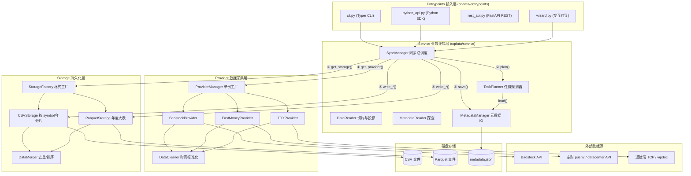

# AGENTS.md - CarrotQuant.Data 代码指南

本文档为 AI Agent 提供对 CarrotQuant.Data 项目的完整理解，包含架构、模块职责、数据流、物理存储布局与开发约束。

---

## 1. 项目概述

CarrotQuant.Data 是一个轻量级、模块化的本地金融数据同步与管理工具。它从免费数据源（Baostock、东方财富、通达信）获取 A 股/指数数据，清洗后持久化到本地 CSV/Parquet 文件，供量化研究和回测使用。

**核心能力**：
- 支持 Baostock（日线/5分线/复权因子）、东方财富（概念/行业板块/龙虎榜/机构交易）、通达信（日线/5分/1分线）
- 支持 CSV 和 Parquet 两种存储格式
- 基于时间戳水位线的增量同步与断点续接
- 三种入口：Python SDK (`cqdata.read_series`/`read_events`)、Typer CLI 控制台 (`cqdata`)、FastAPI REST API

**技术栈**：Python >= 3.12, Polars (数据处理), Baostock, curl_cffi, tdxpy, FastAPI, Typer, Loguru, Pydantic-Settings

---

## 2. 目录结构与模块职责

```
CarrotQuant.Data/
├── cqdata/
│   ├── __init__.py               # 统一导出符号 (read_series, read_events 等)，0 业务逻辑
│   ├── entrypoints/              # 接入层 (python_api, cli, rest_api)
│   ├── config/                   # 配置管理 (支持 CQDATA_STORAGE_ROOT 环境变量与多级 YAML)
│   ├── provider/                 # 数据源驱动层 (Baostock, EastMoney, TDX, DataCleaner, ProviderManager)
│   ├── service/                  # 业务逻辑层 (SyncManager, DataReader, MetadataReader, TaskPlanner, MetadataManager)
│   ├── storage/                  # 持久化存储层 (CSVStorage, ParquetStorage, StorageFactory, DataMerger)
│   └── utils/                    # 工具箱 (logger_utils, time_utils)
├── scripts/                      # 辅助脚本 (wizard.py 交互向导, download_tdx.py)
├── tests/                        # 测试集 (unit, integration)
└── pyproject.toml                # 项目依赖与构建配置
```

---

## 3. 系统架构与数据流

### 3.1 分层架构图


```mermaid
graph TB
    subgraph Entrypoints["Entrypoints 接入层 (cqdata/entrypoints)"]
        PYTHON_API["python_api.py (Python SDK)"]
        CLI["cli.py (Typer CLI)"]
        REST["rest_api.py (FastAPI REST)"]
        WIZARD["wizard.py (交互向导)"]
    end

    subgraph Service["Service 业务逻辑层 (cqdata/service)"]
        SM["SyncManager 同步总调度"]
        DR["DataReader 切片与投影"]
        MR["MetadataReader 探查"]
        TP["TaskPlanner 任务规划器"]
        MM["MetadataManager 元数据 IO"]
    end

    subgraph Provider["Provider 数据采集层"]
        PM["ProviderManager 单例工厂"]
        BP["BaostockProvider"]
        EP["EastMoneyProvider"]
        TP_DRV["TDXProvider"]
        DC["DataCleaner 时间标准化"]
    end

    subgraph Storage["Storage 持久化层"]
        SF["StorageFactory 格式工厂"]
        CSV["CSVStorage 按 symbol/年分片"]
        PQ["ParquetStorage 年度大表"]
        DM["DataMerger 去重/排序"]
    end

    subgraph External["外部数据源"]
        BAOSTOCK["Baostock API"]
        EASTMONEY["东财 push2 / datacenter API"]
        TDX["通达信 TCP / vipdoc"]
    end

    subgraph Disk["磁盘存储"]
        CSV_FILES[("CSV 文件")]
        PQ_FILES[("Parquet 文件")]
        META[("metadata.json")]
    end

    CLI --> SM
    PYTHON_API --> SM
    WIZARD --> SM

    SM -->|"① get_provider()"| PM
    SM -->|"② plan()"| TP
    SM -->|"③ get_storage()"| SF
    SM -->|"④ write_*()"| CSV
    SM -->|"④ write_*()"| PQ
    SM -->|"⑤ save()"| MM

    TP -->|"load()"| MM
    PM --> BP & EP & TP_DRV
    BP --> BAOSTOCK
    EP --> EASTMONEY
    TP_DRV --> TDX
    BP & EP & TP_DRV --> DC

    SF --> CSV & PQ
    CSV & PQ --> DM
    CSV --> CSV_FILES
    PQ --> PQ_FILES
    MM --> META
```

### 3.2 同步数据流

```
用户请求 (CLI / Python SDK / API / Wizard)
    │
    ▼
SyncManager.sync()
    ├── 1. ProviderManager.get_provider(table_id) -> 获得 Provider 实例
    ├── 2. TaskPlanner.plan() -> 比较本地 metadata 水位线与目标时间，规划补充任务
    ├── 3. 批处理循环 (batch_size 切分 symbols):
    │      ├── Provider.fetch() -> 拉取原始数据 -> DataCleaner.standardize() 标准化
    │      └── Batch pl.concat() -> 批量写入 CSVStorage / ParquetStorage
    └── 4. 物理巡检与元数据更新:
           Storage 检查物理状态 -> MetadataManager.save() 原子化更新 metadata.json
```

---

## 4. 核心模块与类职责

### 4.1 接入层 (Gateway)
- **`python_api.py`**: 提供 SDK 高层 API (`read_series`, `read_events`, `sync`, `configure`, `get_schema`, `get_time_range` 等)。
- **`cli.py`**: 基于 Typer 的 CLI 工具 (`cqdata sync`, `cqdata tables`, `cqdata info`, `cqdata serve`, `cqdata wizard`)。
- **`rest_api.py`**: 基于 FastAPI 的 RESTful HTTP 服务，提供查询切片与异步同步任务触发。

### 4.2 业务服务层 (Service)
- **`SyncManager`**: 数据同步总调度器，贯穿 Provider 拉取、批处理、Storage 写入与元数据盖章。
- **`DataReader` / `MetadataReader`**: 提供多年份切片读取、按列投影选择与元数据探查。
- **`TaskPlanner`**: 根据各格式的水位线（取保守交集）规划前向补全与后向拓展的任务区间（首次无水位且未指定 start_date 时默认 fallback 至 2020-01-01）。
- **`MetadataManager`**: 负责 `metadata.json` 的原子化读写（`.tmp` -> `os.replace` -> `fsync`）。

### 4.3 数据驱动层 (Provider)
- **`BaseProvider` (ABC)**: 驱动抽象基类，规范 `fetch`, `get_all_symbols`, `get_supported_tables`, `get_table_category`, `get_sort_keys` 接口。
- **`BaostockProvider`**: Baostock 数据驱动，处理个股/指数 K 线与复权因子，支持断线重连。
- **`EastMoneyProvider`**: 东方财富数据驱动，处理板块成分股、龙虎榜与机构交易，采用 TLS 指纹防封与节流重试。无 symbol 的宏观表 `get_all_symbols` 返回 `["_ALL_"]`。
- **`TDXProvider`**: 通达信数据驱动，支持 `online` (TCP 在线) 与 `local` (vipdoc 离线) 两种模式。
- **`DataCleaner`**: 统一清洗时间轴，转换产生 `timestamp` (Int64 ms) 与 `datetime` (ISO8601) 标准列。
- **`ProviderManager`**: Provider 单例工厂，根据 `table_id` 末段标识路由驱动。

### 4.4 持久化存储层 (Storage)
- **`StorageManager` (ABC)**: 存储抽象基类，统一 `read_series`, `read_event`, `write_series`, `write_event` 接口。
- **`CSVStorage`**: TS 数据按 `[symbol, year]` 分片 CSV；EV 数据按 `[year]` 或平铺存储。
- **`ParquetStorage`**: TS/EV 数据按 `[year]` 保存为 zstd 压缩 Parquet 大表或平铺大表。
- **`DataMerger`**: 负责新旧 Polars DataFrame 的增量合并（`unique keep='last'`）与多维列排序。

---

## 5. Table ID 命名规范

格式: `{market}.{category}.[sub_category/freq/adj].{source}`

| 字段 | 说明 | 示例 |
|:---|:---|:---|
| market | 市场标识 | `ashare` (A股个股), `aindex` (A股指数) |
| category | 数据类别 | `kline` (K线), `adj_factor` (复权因子), `dragon_tiger` (龙虎榜), `concept` (概念板块) |
| freq/adj | 频率/复权 (可选) | `1d` (日线), `5m` (5分钟), `adj` (后复权), `raw` (不复权) |
| source | 数据源 (末段，路由依据) | `baostock`, `eastmoney`, `tdx` |

**主要注册表**:
- `ashare.kline.1d.adj.baostock` / `ashare.kline.1d.raw.baostock` (TS)
- `ashare.kline.5m.adj.baostock` / `ashare.kline.5m.raw.baostock` (TS)
- `ashare.adj_factor.baostock` (EV)
- `ashare.concept.eastmoney` / `ashare.industry.eastmoney` / `ashare.dragon_tiger.eastmoney` (EV)
- `ashare.kline.1d.raw.tdx` / `ashare.kline.5m.raw.tdx` / `ashare.kline.1m.raw.tdx` (TS)

---

## 6. 存储布局与元数据协议

### 6.1 Hive 分区存储结构

```
storage_root/
├── csv/
│   └── {table_id}/
│       ├── year={yyyy}/{symbol}.csv   # TS (TimeSeries) 模式
│       ├── year={yyyy}/data.csv       # EV (Event 有 timestamp) 模式
│       ├── data.csv                   # EV (Event 无 timestamp) 平铺模式
│       └── metadata.json
└── parquet/
    └── {table_id}/
        ├── year={yyyy}/data.parquet   # TS & EV (有 timestamp) 模式
        ├── data.parquet               # EV (无 timestamp) 平铺模式
        └── metadata.json
```

### 6.2 路径模板表

| 数据类型 | CSV 路径 | Parquet 路径 |
|:---|:---|:---|
| TimeSeries (TS) | `csv/{table_id}/year={yyyy}/{symbol}.csv` | `parquet/{table_id}/year={yyyy}/data.parquet` |
| Event (EV) 有 timestamp | `csv/{table_id}/year={yyyy}/data.csv` | `parquet/{table_id}/year={yyyy}/data.parquet` |
| Event (EV) 无 timestamp | `csv/{table_id}/data.csv` | `parquet/{table_id}/data.parquet` |
| 元数据 | `{format}/{table_id}/metadata.json` | `{format}/{table_id}/metadata.json` |

### 6.3 元数据规范 (metadata.json)

每个表及格式维护独立的 `metadata.json`，记载 `schema` 与 `statistics`（包括起止时间戳、ISO时间与 `total_bars`）。
> **EV 表性能优化**：EV 表的 `metadata.json` 严禁包含 `symbol_count` 和 `time_steps` 字段，巡检时跳过大文件全量扫描。
> **复权因子说明**：仅保留后复权因子 `back_adj_factor`，剔除可变的历史前复权因子，防止历史数据变更污染增量水位线。

### 6.4 TS 与 EV 存储行为差异

| 维度 | TS (TimeSeries) | EV (Event) 有 timestamp | EV (Event) 无 timestamp |
|:---|:---|:---|:---|
| 分区模式 | CSV: `[symbol, year]` / PQ: `[year]` | 按 `[year]` | 平铺文件 |
| 去重策略 | `subset=["symbol", "timestamp"]` | 全行去重 `subset=None` | 全行去重 `subset=None` |
| 默认排序 | CSV: `["timestamp"]` / PQ: `["symbol", "timestamp"]` | `["timestamp", "symbol"]` | 由 Provider `get_sort_keys()` 指定 |

---

## 7. 数据协议与双时间轴

### 7.1 核心字段契约
入库数据必须包含以下时间与主键字段：
- `timestamp`: Int64 (UTC 毫秒级时间戳) — 去重、分区、排序的主键
- `datetime`: String (ISO8601 带偏移，如 `"2024-01-01T15:00:00.000+08:00"`) — 强时区带偏移的可读列
- `symbol`: String (证券代码，如 `"sh.600000"`) — 复合主键之一

### 7.2 双时区机制
- **`source_tz`**: 用于解析原始挂钟时间对齐到 UTC 0（默认 `"Asia/Shanghai"`）。
- **`display_tz`**: 用于生成带偏移量的 ISO8601 `datetime` 显示列（默认 `"Asia/Shanghai"`）。
- **A股日线对齐规则**: 日线数据默认统一对齐至 `15:00:00`（A股收盘时间），防止跨日边界物理分区错位。
- 必须使用标准 `zoneinfo` 库处理时区，严禁手动计算偏移。

### 7.3 类型映射规约 (type_map)
读取数据时，必须依据 `metadata.json` 定义的 schema 显式执行 `pl.cast()`：
```python
type_map = {
    "Int64": pl.Int64, "Float64": pl.Float64, "String": pl.String,
    "Boolean": pl.Boolean, "Date": pl.Date, "Datetime": pl.Datetime
}
```

---

## 8. 核心设计原则

1. **原子落盘**: 任何写操作均采用 `.tmp` 文件写入 -> `os.replace` -> `fsync` 刷盘，杜绝写入中断导致文件损坏。
2. **读取强锁与显式 Cast**: 读取数据时必须读取 `metadata.json` 的 schema 进行显式 `pl.cast()`，严禁使用 Polars 自动类型推断。
3. **空数据防御三层机制**:
   - *驱动层*: 无数据时也必须通过 `DataCleaner` 返回带完整 schema 的空 DataFrame。
   - *存储层*: 传入空 DataFrame 时静默拦截，不创建空文件或残留目录。
   - *元数据层*: `total_bars=0` 且无元数据时不创建文件；无新数据且已有元数据时不重复更新。
4. **Fail-Fast 异常分发**:
   - 网络中断、网络授权失效或非法参数：必须抛出异常中断流水线，防止水位线被误推进。
   - 业务合法空数据（如停牌、无龙虎榜记录）：允许返回带 Schema 的空表。
5. **增量水位线**: 多格式同步时水位线取交集保守计算 (`start` 取 max, `end` 取 min)，保证各存储格式完整覆盖。
6. **无损降级处理**: EV 数据在缺少 `symbol` 列时自动回退为仅按 `timestamp` 排序，严禁抛出 `ColumnNotFoundError`。

---

## 9. 开发与测试约束

- **技术栈禁令**: 强制全系统使用 Polars (`pl`)，**严禁使用 pandas**。
- **复权约束**: 仅支持 `raw` (不复权) 或 `adj` (后复权)，禁止前复权。
- **干净入口**: `cqdata/__init__.py` 仅用于符号导出，实现 **0 业务逻辑**。
- **时区规范**: 统一使用 `zoneinfo`，禁止手动加减小时偏移。
- **日志与输出**:
  - 系统日志使用 Loguru，输出挂载至 `stderr` 及 `logs/{prefix}_{YYYYMMDD_HHMMSS}.log`。
  - 核心驱动层调第三方库（如 Baostock）必须使用 `SuppressOutput` 包裹，防止垃圾 `print` 污染 CLI 控台。
- **测试与运行**:
  - 所有命令使用 `uv run` 前缀（如 `uv run pytest tests/ -v`）。
  - 实现新功能或修改 Bug 时必须同步补充/修改对应的单元测试。
- **Git 提交**:
  - 消息语言为中文，遵从 Conventional Commits 规范（如 `feat:` / `fix:` / `refactor:`）。
  - 未经用户明确确认，禁止自动执行 `git add/commit/push` 操作。
- **架构一致性**: 任何涉及架构、数据流或核心 API 的改动，必须同步更新本 `AGENTS.md`。

---

## 10. 测试结构与运行

### 10.1 测试目录结构
```
tests/
├── conftest.py                    # 全局 fixtures (temp_storage_root, mock_baostock)
├── unit/                          # 工具、Provider、Storage、Service 及 Entrypoints 单元测试 (mock IO)
└── integration/                   # 真实 API 与全流程同步测试 (包含全量/增量/防封/空数据测试)
```

### 10.2 常用测试命令
```bash
uv run pytest tests/ -v                                   # 运行全部测试
uv run pytest tests/unit/ -v                              # 仅运行单元测试
uv run pytest tests/unit/test_utils_time.py -v            # 运行指定测试文件
```

---

## 11. 新增数据源指南

新增数据源驱动时遵循以下步骤：
1. 在 `cqdata/provider/` 下新建 `{source}_provider.py`，继承 `BaseProvider`。
2. 实现 `fetch`, `get_all_symbols`, `get_supported_tables`, `get_table_category`, `get_sort_keys` 方法。
3. 在类属性 `_SUPPORTED_TABLE_MAP` 中注册可用的 `table_id`。
4. 在 `ProviderManager.get_provider()` 中加入该驱动的路由逻辑。
5. 驱动调第三方 API 时使用 `SuppressOutput` 包裹控制台输出。
6. `fetch()` 返回数据需经过 `DataCleaner.standardize()`，无数据时返回带完整 Schema 的空表。
7. 在 `tests/unit/` 和 `tests/integration/` 中补充对应的单元与集成测试。
