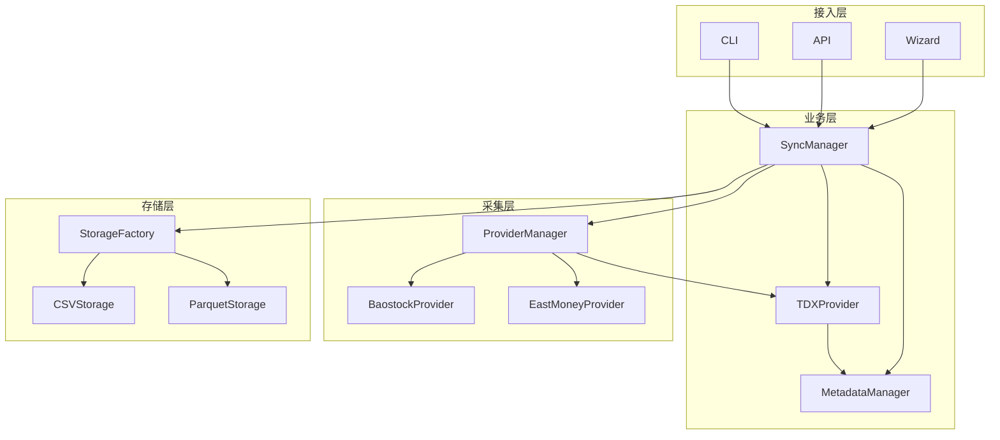

# CarrotQuant.Data


CarrotQuant.Data 是一个为量化交易体系设计的轻量级、模块化的本地数据同步与管理工具。它致力于从各类免费数据源（如 Baostock、东方财富等）获取金融数据，并将数据清洗、转换为统一格式（支持 CSV, Parquet 等），持久化到本地存储中以供各类量化研究和回测使用。

## 🌟 核心特性 (Features)

- **多数据源支持**：内置 [Baostock](http://baostock.com/)、东方财富、[通达信 (tdxpy)](https://github.com/rainx/tdxPy) 等金融数据源引擎，易于弹性拓展更多的数据源提供商。
- **灵活的存储格式**：原生支持 `csv` 和基于列式存储的高效 `parquet` 格式，以满足不同体量的数据读写需求。
- **增量与全量同步**：基于时间戳水位线的同步机制，支持从断点智能续接（增量拉取），以及强制全量覆盖更新刷新数据。
- **现代化多入口支持**：
  - 提供简单直观的 **同步向导 (Wizard)** 供快速交互使用。
  - 健壮的 **命令行工具 (CLI)** 供自动化调度（如 Crontab 等定时任务）无缝集成。
  - 基于 FastAPI 的 **REST API 网关**，支持远程触发同步、查询数据与任务状态。
- **优秀的底层性能**：使用 [Polars](https://pola.rs/) 库进行高性能的数据加工和清洗。

## 📁 目录结构 (Project Structure)

```text
CarrotQuant.Data/
├── app/
│   ├── config/       # 配置管理模块
│   ├── gateway/      # 接入层（CLI命令行与HTTP API 网关 API.py）
│   ├── provider/     # 数据源驱动（BaostockProvider, EastMoneyProvider, TDXProvider）
│   ├── service/      # 核心业务逻辑实现（SyncManager, TaskPlanner等）
│   ├── storage/      # 本地持久化与格式处理模块
│   └── utils/        # 通用工具箱（如日志记录 Logger 等）
├── scripts/
│   ├── wizard.py         # 开箱即用的终端交互向导
│   └── download_tdx.py   # 通达信日线数据下载脚本
├── tests/            # 单元测试与集成测试
├── config/           # 项目配置文件存放目录
├── logs/             # 系统运行日志目录
├── AGENTS.md         # AI Agent 架构指南（分层架构、数据流、开发约束）
└── pyproject.toml    # 项目的构建及依赖配置 (uv/pip)
```

## 🏗️ 系统架构



## 📊 支持的数据表 (Supported Tables)

| Table ID | 类型 | 说明 |
|----------|------|------|
| `ashare.kline.1d.adj.baostock` | TS | A 股日线后复权 |
| `ashare.kline.1d.raw.baostock` | TS | A 股日线不复权 |
| `ashare.kline.5m.adj.baostock` | TS | A 股 5 分钟线后复权 |
| `ashare.kline.5m.raw.baostock` | TS | A 股 5 分钟线不复权 |
| `aindex.kline.1d.raw.baostock` | TS | A 股指数日线 |
| `ashare.adj_factor.baostock` | EV | A 股复权因子 |
| `ashare.concept.eastmoney` | EV | 概念板块成分股 |
| `ashare.industry.eastmoney` | EV | 行业板块成分股 |
| `ashare.dragon_tiger.eastmoney` | EV | 龙虎榜 |
| `ashare.inst_trade.eastmoney` | EV | 机构买卖每日统计 |
| `ashare.kline.1d.tdx` | TS | A 股日线 (通达信) |
| `ashare.kline.5m.tdx` | TS | A 股 5 分钟线 (通达信) |
| `ashare.kline.1m.tdx` | TS | A 股 1 分钟线 (通达信) |
| `aindex.kline.1d.tdx` | TS | 指数日线 (通达信) |
| `aindex.kline.5m.tdx` | TS | 指数 5 分钟线 (通达信) |
| `aindex.kline.1m.tdx` | TS | 指数 1 分钟线 (通达信) |

## 🛠️ 安装指南 (Installation)

环境要求：**Python >= 3.12**。本项目推荐使用现代化的 Python 包管理器 [uv](https://github.com/astral-sh/uv) 进行极速安装与管理，当然也兼容传统的 pip 或 poetry 方案。

1. **克隆项目到本地**
    ```bash
    git clone https://github.com/CRThu/CarrotQuant.Data.git
    cd CarrotQuant.Data
    ```

2. **使用 uv 安装依赖**
    ```bash
    # 如果还没有安装 uv 可以先全局安装
    # pip install uv
    
    # 自动创建虚拟环境并同步所需的依赖库
    uv sync
    ```

## 🚀 快速开始 (Quick Start)

### 方式一：使用交互式向导 (Wizard) - 推荐

适合新手或偶尔需要手动触发同步的任务：

```bash
uv run scripts/wizard.py
```
这会启动一个精美的 CLI 交互向导，引导您进行如下配置：
1. 选择需要同步的数据表（如下载 A 股日K线、复权因子等）。
2. 配置起始和结束日期（如果不输入则是智能增量拉取）。
3. 选择保存格式（`csv`, `parquet`）和批处理大小配置并确认执行任务。

### 方式二：使用 CLI 命令行工具

如果您需要把同步流程集成到自动化脚本或是定时任务系统里，可直接调用 CLI 入口：

```bash
# Baostock 日线 + 复权因子同步
uv run -m app.gateway.cli sync \
  --tables "ashare.kline.1d.adj.baostock,ashare.adj_factor.baostock" \
  --formats "csv,parquet" \
  --start "2023-01-01" \
  --end "2023-12-31"

# 通达信在线同步 (默认)
uv run -m app.gateway.cli sync -t ashare.kline.1d.tdx

# 通达信本地同步 (使用 vipdoc 目录)
uv run -m app.gateway.cli sync -t ashare.kline.1d.tdx --local

# 下载通达信日线数据到 vipdoc (不覆盖分钟线)
uv run -m app.gateway.cli tdx download
```
**关键参数说明：**
- `--tables` / `-t`: 必须项。要同步的表 ID，多表间用英文逗号分隔。
- `--formats` / `-f`: 选填，保存格式，如 `csv,parquet`。
- `--start` / `-s` & `--end` / `-e`: 选填，同步的时间范围，留空则是自动续接水位线增量同步。
- `--force`: 选填。加上该标记则强制覆盖全量刷新。
- `--local`: 选填。使用本地 vipdoc 目录模式 (通达信数据源)。
- `--tdx-vipdoc`: 选填。通达信 vipdoc 目录路径 (默认 `C:\new_tdx\vipdoc`)。

### 方式三：启动 API 服务

```bash
uv run -m app.gateway.cli server --port 8000
```

启动后可通过 REST API 进行远程操作：

| 端点 | 方法 | 说明 |
|------|------|------|
| `/api/v1/sync` | POST | 异步触发数据同步 |
| `/api/v1/tasks` | GET | 查询活跃同步任务 |
| `/api/v1/data/{table_id}` | GET | 查询已同步的数据 |

## 📝 许可证 (License)

本项目遵循 [Apache License 2.0](LICENSE) - 详细请参阅 LICENSE 文件。
