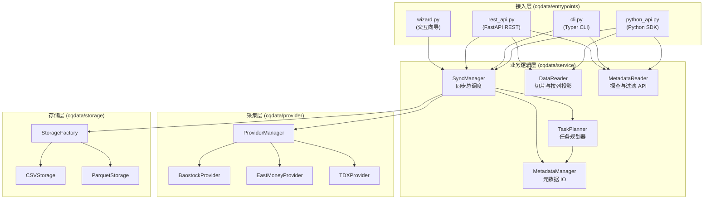

# CarrotQuant.Data


CarrotQuant.Data 是一个为量化交易体系设计的轻量级、模块化的本地数据同步与管理工具。它致力于从各类免费数据源（如 Baostock、东方财富等）获取金融数据，并将数据清洗、转换为统一格式（支持 CSV, Parquet 等），持久化到本地存储中以供各类量化研究和回测使用。

## 🌟 核心特性 (Features)

- **多数据源支持**：内置 [Baostock](http://baostock.com/)、东方财富、[通达信 (tdxpy)](https://github.com/rainx/tdxPy) 等金融数据源引擎，易于弹性拓展更多的数据源提供商。
- **灵活的存储格式**：原生支持 `csv` 和基于列式存储的高效 `parquet` 格式，以满足不同体量的数据读写需求。
- **增量与全量同步**：基于时间戳水位线的同步机制，支持从断点智能续接（增量拉取），以及强制全量覆盖更新刷新数据。
- **现代化多通道接入支持**：
  - **Python SDK**：简单直观的 `import cqdata` API，支持高性能跨年份数据切片读取 (`cqdata.read_series`, `cqdata.read_events`)、`columns` 按需字段选择、格式识别与元数据探查。
  - **命令行工具 (CLI)**：统一的 `cqdata` 命令行工具，提供数据同步 (`cqdata sync`)、数据表探索 (`cqdata tables`)、元数据查询 (`cqdata info`) 与 HTTP 服务启动 (`cqdata serve`)。
  - **REST API 服务**：基于 FastAPI 的 REST API，为远程微服务提供 HTTP 数据切片与同步触发。
- **优秀的底层性能**：使用 [Polars](https://pola.rs/) 库进行高性能的数据加工和清洗。

## 📁 目录结构 (Project Structure)

```text
CarrotQuant.Data/
├── cqdata/           # 核心代码包 (支持 import cqdata)
│   ├── entrypoints/  # 接入层 (python_api, cli, rest_api)
│   ├── config/       # 配置管理模块
│   ├── provider/     # 数据源驱动 (BaostockProvider, EastMoneyProvider, TDXProvider)
│   ├── service/      # 核心业务逻辑 (DataReader, MetadataReader, SyncManager 等)
│   ├── storage/      # 本地持久化存储 (CSVStorage, ParquetStorage)
│   └── utils/        # 通用工具箱
├── scripts/
│   ├── wizard.py         # 交互向导脚本 (也可通过 cqdata wizard 运行)
│   └── download_tdx.py   # 通达信数据下载脚本
├── tests/            # 单元测试与集成测试
├── config/           # 项目配置文件存放目录
├── logs/             # 系统运行日志目录
├── AGENTS.md         # AI Agent 架构指南
└── pyproject.toml    # 项目构建及依赖配置
```

## 🏗️ 系统架构


```mermaid
graph TB
    subgraph Entrypoints["接入层 (cqdata/entrypoints)"]
        PYTHON_API["python_api.py<br/>(Python SDK)"]
        CLI["cli.py<br/>(Typer CLI)"]
        REST["rest_api.py<br/>(FastAPI REST)"]
        WIZARD["wizard.py<br/>(交互向导)"]
    end

    subgraph Service["业务逻辑层 (cqdata/service)"]
        SM["SyncManager<br/>同步总调度"]
        DR["DataReader<br/>切片与按列投影"]
        MR["MetadataReader<br/>探查与过滤 API"]
        TASK_PLANNER["TaskPlanner<br/>任务规划器"]
        MM["MetadataManager<br/>元数据 IO"]
    end

    subgraph Provider["采集层 (cqdata/provider)"]
        PM["ProviderManager"]
        BP["BaostockProvider"]
        EP["EastMoneyProvider"]
        TDX_PROV["TDXProvider"]
    end

    subgraph Storage["存储层 (cqdata/storage)"]
        SF["StorageFactory"]
        CSV["CSVStorage"]
        PQ["ParquetStorage"]
    end

    PYTHON_API --> DR
    PYTHON_API --> MR
    PYTHON_API --> SM
    CLI --> SM
    CLI --> MR
    REST --> DR
    REST --> MR
    REST --> SM
    WIZARD --> SM

    SM --> TASK_PLANNER
    SM --> PM
    SM --> SF
    TASK_PLANNER --> MM
    SM --> MM
    PM --> BP
    PM --> EP
    PM --> TDX_PROV
    SF --> CSV
    SF --> PQ
```

## 📊 支持的数据表 (Supported Tables)

| Table ID | 类型 | 说明 |
|----------|------|------|
| `ashare.kline.1d.adj.baostock` | TS | A 股日线后复权 |
| `ashare.kline.1d.raw.baostock` | TS | A 股日线不复权 |
| `ashare.kline.5m.adj.baostock` | TS | A 股 5 分钟线后复权 |
| `ashare.kline.5m.raw.baostock` | TS | A 股 5 分钟线不复权 |
| `aindex.kline.1d.raw.baostock` | TS | A 股指数日线 |
| `ashare.adj_factor.baostock` | EV | A 股复权因子 |
| `ashare.concept.eastmoney` | EV | 概念板块成分股 |
| `ashare.industry.eastmoney` | EV | 行业板块成分股 |
| `ashare.dragon_tiger.eastmoney` | EV | 龙虎榜 |
| `ashare.inst_trade.eastmoney` | EV | 机构买卖每日统计 |
| `ashare.kline.1d.raw.tdx` | TS | A 股日线 (通达信) |
| `ashare.kline.5m.raw.tdx` | TS | A 股 5 分钟线 (通达信) |
| `ashare.kline.1m.raw.tdx` | TS | A 股 1 分钟线 (通达信) |
| `aindex.kline.1d.raw.tdx` | TS | 指数日线 (通达信) |
| `aindex.kline.5m.raw.tdx` | TS | 指数 5 分钟线 (通达信) |
| `aindex.kline.1m.raw.tdx` | TS | 指数 1 分钟线 (通达信) |

## 🛠️ 安装指南 (Installation)

环境要求：**Python >= 3.12**。本项目推荐使用现代化的 Python 包管理器 [uv](https://github.com/astral-sh/uv) 进行极速安装与管理。

1. **克隆项目并安装**
    ```bash
    git clone https://github.com/CRThu/CarrotQuant.Data.git
    cd CarrotQuant.Data

    # 可选：可编辑模式挂载命令行 cqdata
    uv pip install -e .
    ```

## ⚙️ 配置说明 (Configuration)

CarrotQuant.Data 支持多层级配置加载与灵活注入，优先级从高到低依次为：

1. **代码程序化指定**：调用 `cqdata.configure(storage_root="/path/to/storage")` 或函数传参 `storage_root`（最高优先级）。
2. **环境变量 `CQDATA_STORAGE_ROOT`**：如 `export CQDATA_STORAGE_ROOT="/my/data/path"`（适合 Docker / 自动化部署）。
3. **环境变量 `CQDATA_CONFIG`**：指定自定义 YAML 路径，如 `export CQDATA_CONFIG="/path/to/config.yaml"`。
4. **工作目录配置**：当前工作路径下的 `./config/config.yaml` 或 `./config.yaml`。
5. **用户主目录配置**：`~/.cqdata/config.yaml`。
6. **默认缺省路径**：`storage_root`。

---

## 🚀 快速开始 (Quick Start)

### 方式一：使用 Python SDK (`import cqdata`) - 推荐

在量化研究与 Python 策略脚本中直接读取本地清洗好的数据：

```python
import cqdata

# 0. (可选) 全局程序化配置存储路径
cqdata.configure(storage_root="/path/to/storage")

# 1. 探索本地已下载的数据表列表
series_tables = cqdata.list_series_tables()  # ['ashare.kline.1d.raw.baostock', ...]
event_tables = cqdata.list_event_tables()    # ['ashare.adj_factor.baostock', ...]

# 2. 探查数据表属性与辅助过滤条件
formats = cqdata.list_formats("ashare.kline.1d.raw.baostock")     # ['parquet', 'csv']
symbols = cqdata.list_symbols("ashare.kline.1d.raw.baostock")     # ['sh.600000', ...]
start_dt, end_dt = cqdata.get_time_range("ashare.kline.1d.raw.baostock")
schema = cqdata.get_schema("ashare.kline.1d.raw.baostock")         # {'timestamp': 'Int64', ...}
total_rows = cqdata.get_row_count("ashare.kline.1d.raw.baostock") # 13570685

# 3. 显式切片读取 K 线时序数据 (支持 columns 按需挑选列，极节省内存)
df = cqdata.read_series(
    table_id="ashare.kline.1d.raw.baostock",
    symbols=["sh.600000", "sz.000001"],
    start_date="2024-01-01",
    end_date="2024-06-30",
    columns=["timestamp", "datetime", "symbol", "close", "volume"],
    as_pandas=False  # 默认返回 Polars DataFrame，设为 True 返回 Pandas DataFrame
)
print(df)

# 4. 读取事件/板块静态数据
events_df = cqdata.read_events(
    table_id="ashare.adj_factor.baostock",
    symbols=["sh.600000"]
)

# 5. 代码中触发全自动数据同步
cqdata.sync(table_ids=["ashare.kline.1d.raw.baostock"], formats=["parquet"])
```

### 方式二：使用统一 CLI 命令行工具 (`cqdata`)

可在终端或 Cron 定时任务中直接调用 `cqdata` 交互：

```bash
# 查看本地存储的所有数据表概览
cqdata tables

# 查看某张表的物理行数、代码列表与 Schema 详细元数据
cqdata info ashare.kline.1d.raw.baostock

# 触发自动增量同步
cqdata sync --tables "ashare.kline.1d.raw.baostock,ashare.adj_factor.baostock"

# 指定日期区间与保存格式进行全量强制更新
cqdata sync -t ashare.kline.1d.raw.baostock -f parquet -s 2023-01-01 -e 2023-12-31 --force
```

#### 💡 通达信 (TDX) 最佳同步实践说明

通达信驱动支持 **Local (离线 vipdoc 导包)** 与 **Online (在线 TCP 协议)** 两种模式。两者的输出格式和字段完全对齐，落地在同一个 `table_id` 下，数据会自动无缝去重与合并。

- **Local 离线模式读取能力**：原生支持解析本地 `vipdoc` 目录下的 **日线 (`.day`)、5分钟线 (`.lc5`) 以及 1分钟线 (`.lc1`)** 等所有离线二进制文件（包含通达信软件自行下载导出的分钟线文件）。
- **极速初始化脚本 (`cqdata tdx download`)**：用于一键拉取并解压通达信官方服务器的全量日线行情包（`hsjday.zip`），实现数十年日线历史数据的秒级导入。

> [!TIP]
> **强烈推荐的最佳实践流程**：
> 1. **首次极速初始化（Local 模式）**：通过 `cqdata tdx download` 下载官方 `vipdoc` 日线离线包（或直接挂载本地已有的通达信客户端 `vipdoc` 目录）解析导入，秒级完成历史数据装载。
> 2. **日常增量更新（Online 模式）**：日常收盘后直接执行在线增量同步，系统会自动根据水位线补全最新几日的增量 K 线（支持 1d / 5m / 1m）。

```bash
# 步骤 1: 极速初始化 - 下载并解压通达信官方全量日线行情包 (hsjday.zip)
cqdata tdx download
# 或使用 uv 直接运行下载脚本 (也可通过 --tdx-vipdoc 指定本地已有通达信客户端目录)
uv run scripts/download_tdx.py

# 步骤 2: 日常盘后增量 - 触发通达信在线按水位线追加最新数据 (支持 1d 日线 / 5m / 1m 分钟线)
cqdata sync -t ashare.kline.1d.raw.tdx
```

**命令行关键参数：**
- `-t` / `--tables`: 必填，要同步的表 ID，多表用逗号分隔。
- `-f` / `--formats`: 选填，保存格式（默认 `parquet,csv`）。
- `-s` / `--start` & `-e` / `--end`: 选填，时间范围，留空则是自动接续水位线增量同步。
- `--force`: 选填，强制全量刷新覆盖。
- `--limit`: 选填，限制同步代码数量（调试用）。

### 方式三：使用终端交互向导 (Wizard)

```bash
cqdata wizard
```

### 方式四：启动 REST API HTTP 服务

```bash
cqdata serve --port 8000
```

启动后提供标准 RESTful HTTP 接口（全量端点汇总）：

| 端点 | 方法 | 说明 |
|------|------|------|
| `/api/v1/tables/series` | GET | 列出本地所有时序表 ID |
| `/api/v1/tables/events` | GET | 列出本地所有事件表 ID |
| `/api/v1/tables/{table_id}/formats` | GET | 获取指定表已存储的物理格式列表 (`['parquet', 'csv']`) |
| `/api/v1/tables/{table_id}/symbols` | GET | 获取指定表已下载的股票/证券代码列表 |
| `/api/v1/tables/{table_id}/time_range` | GET | 获取指定表的时间跨度 tuple `(start_datetime, end_datetime)` |
| `/api/v1/tables/{table_id}/schema` | GET | 获取指定表的字段列名与类型字典 |
| `/api/v1/tables/{table_id}/row_count` | GET | 获取指定表的记录总条数/行数 |
| `/api/v1/query/series` | POST | 切片查询时序数据（支持 `symbols`, `start_date`, `end_date`, `columns`, `format`） |
| `/api/v1/query/events` | POST | 切片查询事件数据（支持 `symbols`, `start_date`, `end_date`, `columns`, `format`） |
| `/api/v1/sync` | POST | 异步触发后台数据同步任务 |
| `/api/v1/tasks` | GET | 查询活跃同步任务状态 |

## 📝 许可证 (License)

本项目遵循 [Apache License 2.0](LICENSE) - 详细请参阅 LICENSE 文件。
